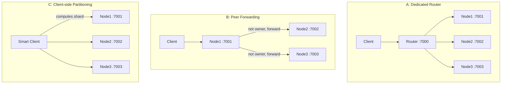

# KV Store — Implementation Plan (Parts 1 and 2)

Scala + Play. Part 3 is design-only and out of scope here.

The brief suggests 3–5 hours. This plan in full is closer to 8–10 — see [Effort estimate](#effort-estimate) for the breakdown and for the cut list that brings it back inside five.

## Stack and versions

Targeting **Play 2.8.21, Scala 2.12.x, JDK 11**, sbt 1.x — matching the production stack rather than the newest release.

- Play 2.8 runs on **Akka 2.6** (imports are `akka.*`). Pekko is a straight fork of Akka 2.6, so all the streaming code in Part 2 is portable between the two by package rename alone.
- Akka 2.6 is still Apache 2.0 licensed; the BSL change landed in Akka 2.7, so there is no licensing concern here.
- Tests: `scalatestplus-play` 5.1.0 (which pulls ScalaTest 3.1.x), plus `play-ws` for the router and for end-to-end tests.
- Nothing is installed on this machine yet (no JDK, no sbt). Install is a prerequisite step, not part of the code work.

Exact coordinates, since the Play 2.8 line uses different ones from Play 3.x:

```scala
// build.sbt
scalaVersion := "2.12.18"
libraryDependencies ++= Seq(
  guice,
  ws,                                                              // play-ws, for the router
  "org.scalatestplus.play" %% "scalatestplus-play" % "5.1.0" % Test
)
```

```scala
// project/plugins.sbt
addSbtPlugin("com.typesafe.play" % "sbt-plugin" % "2.8.21")
```

**Gotcha:** the sbt plugin organization is `com.typesafe.play` on the 2.8 line. Play 3.0 renamed it to `org.playframework`, so any snippet copied from current docs will fail with a confusing "not found" error rather than a version mismatch.

### Why this stack, if asked

Play 2.8 reached end of life on 31 May 2024 and no longer receives security patches, so this is worth pre-empting rather than being caught by. The answer: it matches the environment this code would actually live in, and for anything greenfield the target would be Play 3.0, where the migration is largely the `akka.*` → `org.apache.pekko.*` rename described above. Nothing in this design depends on a version-specific feature.

### What is genuinely given up versus JDK 17

Only one item is substantive: **ZGC is experimental on JDK 11** and needs `-XX:+UnlockExperimentalVMOptions`; it became production-ready at 15. For an in-memory store, "what happens when the heap gets large" is a natural Part 3 thread, and the answer here is G1 with realistic pause targets rather than sub-millisecond ZGC pauses. Still a defensible answer, just a weaker one.

Not a factor either way: virtual threads are JDK 21, so neither 11 nor 17 has them. Raw JIT performance on 17 is modestly better, which is invisible for a correctness demo. Scala 2.12 lacks `scala.util.Using` and `LazyList`, neither of which this design uses.

## Repository layout

Single sbt module. Process role is chosen by config, so one build produces both node and router.

```
build.sbt
project/plugins.sbt
conf/
  application.conf          # kv.role, kv.nodeId, kv.nodes
  routes                    # public API
  node.routes / router.routes (or role-guarded actions)
app/
  models/VersionedValue.scala
  models/WriteResult.scala
  store/KvStore.scala             # trait
  store/InMemoryKvStore.scala     # Part 1 engine
  controllers/KvController.scala  # Part 1 API
  cluster/Partitioner.scala       # Part 2 key -> node
  cluster/NodeRegistry.scala      # config-driven node list
  cluster/RemoteNodeClient.scala  # WS proxy helper
  controllers/RouterController.scala
  controllers/InternalController.scala  # /internal/keys (NDJSON)
test/
  store/InMemoryKvStoreSpec.scala
  controllers/KvControllerSpec.scala
  concurrency/CounterSpec.scala   # the required 3x100 test
  cluster/PartitionerSpec.scala
  cluster/ClusterE2ESpec.scala
docker/Dockerfile, docker-compose.yml
README.md
```

Alternative considered: sbt multi-module (`common` / `node` / `router`). Rejected as over-structured for a timeboxed assignment; a single module with a role flag is easier to run and to walk through.

---

# Part 1 — Single node

## Concurrency model: `ConcurrentHashMap.compute`

This is the core decision and the main thing to defend in the walkthrough.

`ConcurrentHashMap.compute(key, fn)` runs the remapping function **while holding the bin lock for that key**. That gives exactly the required semantics for free:

- Operations on the same key are serialized
- Operations on different keys proceed concurrently
- The read-check-write of the `ifVersion` guard is atomic, so no lost updates and no torn reads

Read-modify-write must happen *inside* the lambda, never as a separate get-then-put.

```scala
final case class VersionedValue(value: JsValue, version: Long)

sealed trait WriteResult
object WriteResult {
  final case class Written(vv: VersionedValue) extends WriteResult
  final case class Conflict(currentVersion: Option[Long]) extends WriteResult
}
```

```scala
private val map = new ConcurrentHashMap[String, VersionedValue]()

private def mutate(key: String, ifVersion: Option[Long])
                  (next: Option[VersionedValue] => JsValue): WriteResult = {
  val outcome = new AtomicReference[WriteResult]()
  map.compute(key, (_: String, current: VersionedValue) => {
    val cur = Option(current)
    ifVersion match {
      case Some(v) if !cur.exists(_.version == v) =>
        outcome.set(WriteResult.Conflict(cur.map(_.version)))
        current                                  // leave mapping untouched
      case _ =>
        val vv = VersionedValue(next(cur), cur.map(_.version + 1).getOrElse(1L))
        outcome.set(WriteResult.Written(vv))
        vv
    }
  })
  outcome.get()
}
```

`put` passes `_ => body`. `patch` passes the merge function below.

Constraints to respect and to mention in the walkthrough: the lambda must be short, must not block, and must not touch the map itself (that deadlocks). All three hold here because storage is pure in-memory.

**Scala 2.12 note:** SAM conversion works (it was the headline 2.12 feature), so a lambda can be passed directly where Java expects a `BiFunction`. But 2.12's inference through `compute`'s `BiFunction[K, V, V]` is weaker than 2.13's, so the parameters are annotated explicitly above. Without the annotations this can fail to compile with a misleading "missing parameter type" error — worth knowing in advance, since it sits in the twenty most important lines of the project.

`ConcurrentHashMap.compute` behaves identically on JDK 11 and 17; the per-key bin-locking contract has been stable since Java 8. The entire Part 1 correctness argument is therefore unaffected by the JDK choice.

**Alternatives to have ready for the "discuss alternatives" segment:**
- *Striped locks* (`lock[hash(key) % N]`) — coarser, unrelated keys contend on a shared stripe
- *Actor per key* (Akka Typed, already on the classpath via Play 2.8) — matches "atomicity by key" most literally, mailbox serializes; costs actor lifecycle and passivation for unbounded keyspace
- *`AtomicReference` per key + CAS retry* — lock-free, but retry loops under contention and still needs a concurrent map to hold the refs

## Version semantics

- Created at `1`, `+1` on every successful mutation
- No history kept — only the current version, per the brief
- `ifVersion` on a **missing** key returns **409**. Documented as a deliberate choice; the alternative convention is `ifVersion=0` meaning "must not exist", which is worth raising as an edge case.

## Merge semantics for PATCH

```scala
(current.value, delta) match {
  case (e: JsObject, d: JsObject) => e ++ d   // ++ is shallow; right side wins
  case _                          => delta    // otherwise replace
}
```

Play's `++` on `JsObject` is a shallow top-level merge, which is precisely what the brief asks for. `deepMerge` would be wrong here.

## API surface

| Route | Behaviour |
|---|---|
| `GET /kv/:key` | 200 `{key, value, version}`, else 404 |
| `PUT /kv/:key` | Replace whole value; 409 on `ifVersion` mismatch |
| `PATCH /kv/:key` | Create if absent; shallow-merge if both are objects; else replace; 409 on mismatch |

- `ifVersion` accepted as a **query param** and as the `If-Match` header, query taking precedence
- Non-numeric `ifVersion` → 400; malformed JSON body → 400
- Bump `play.http.parser.maxMemoryBuffer` (default 100KB is low for "arbitrary JSON")
- Keys containing `/` break path matching — use a wildcard route (`/kv/*key`) or require URL-encoding, and document it

## Part 1 testing

Unit tests on the store: version increments, conflict on mismatch, PATCH-create, object merge, non-object replace.

Controller tests for status codes and response shape.

**The required concurrency test — 3 clients x 100 increments = 300.** Worth building as a *pair* of tests, because the contrast is the strongest demo moment in Part 1:

- **Test A, no `ifVersion`:** each client does GET then PATCH. Final value is reliably **< 300** — this is the lost-update problem made visible.
- **Test B, with `ifVersion` + retry:** each client does GET, PATCH with the observed version, and retries on 409. Final value is **exactly 300**.

Test B is the one the brief requires; Test A exists to prove *why* the guard is necessary. Assert on the final version too (301 after 300 successful writes plus the create), which catches silent double-applies.

**Test A is nondeterministic by construction — budget for this.** It only passes if the threads actually lose a race. On a fast machine they may happen to serialize, the result comes back as 300, and the test fails. A flaky test in a submission is worse than no test, so make the race deterministic rather than hoping for it: insert a short delay between the read and the write inside the client loop, widening the window so the lost update is reliable.

```scala
// Test A only: force the interleaving instead of relying on luck
val current = get(key)
Thread.sleep(5)                    // deliberate, and commented as such
patch(key, current.value + 1)      // no ifVersion — this is the bug being demonstrated
```

Assert `finalValue < 300` rather than a specific number, since how many updates are lost is still timing-dependent. Name the test so its intent is obvious (`demonstratesLostUpdateWithoutIfVersion`) and comment the sleep, otherwise it reads like a mistake to a reviewer. Test B needs no such trick — it is deterministic by design, since the retry loop guarantees convergence — but it does need a retry cap so a bug produces a failure instead of a hang.

---

# Part 2 — Multi-node scale-out

Shared foundation for all three topologies:

```scala
trait Partitioner { def ownerOf(key: String): NodeRef }
```

- **`ModuloPartitioner`** (default): `Math.floorMod(MurmurHash3.stringHash(key), nodes.size)`. Simple, even, deterministic.
- **`ConsistentHashPartitioner`** (optional): hash ring with ~150 virtual nodes per physical node. Only ~1/N of keys move when membership changes, versus nearly all with modulo. Not needed for fixed N, but it is the natural Part 3 roadmap hook, so having the trait in place costs nothing.

Node list comes from config so all processes agree:

```hocon
kv.role   = node                # node | router
kv.nodeId = node-1
kv.nodes  = [
  { id = "node-1", url = "http://localhost:7001" },
  { id = "node-2", url = "http://localhost:7002" },
  { id = "node-3", url = "http://localhost:7003" }
]
```

Every node also exposes `GET /internal/keys` streaming its own keys as NDJSON.

## The three topologies



### A — Dedicated router (recommended)

Stateless router process computes the owner and proxies over `play-ws`. Storage nodes run **unmodified Part 1 code** plus the internal keys endpoint.

- **For:** single entry point so the Part 1 curl commands work unchanged; node code untouched, which makes the walkthrough a clean "Part 1 is a component of Part 2" story; `GET /kv` fan-out has an obvious home; trivial to demo.
- **Against:** one extra network hop on every request; the router is a throughput ceiling and a single point of failure; one more process to run.
- **Verdict:** the SPOF objection is explicitly neutralised by the brief ("high availability and redundancy are not required"), and the node-code-unchanged property is worth more than the hop. **This is the one to build.**

### B — Peer forwarding

Every node knows the full ring. If it owns the key it serves locally, otherwise it proxies to the owner with an `X-Forwarded-Internal: true` marker so the receiving node serves locally and never forwards again.

- **For:** no extra process; any node is a valid entry point; when the client happens to hit the owner there is zero extra hop; closest to how a real HA cluster (gossip, membership) would evolve.
- **Against:** routing and proxy logic now lives in every node, so node code is materially more complex; a diverged ring config between nodes causes misroutes or forwarding loops; the loop guard is a correctness-critical detail that is easy to get subtly wrong; `GET /kv` fan-out must exist on every node.
- **Cost on top of A:** small. Same `Partitioner` and `RemoteNodeClient`, plus a guard in the controller. Reachable as a stretch if time allows.

### C — Client-side partitioning

The client or test harness computes the shard and calls the owning node directly.

- **For:** lowest possible latency, no extra hop, no routing code server-side, nodes stay exactly as Part 1.
- **Against:** every client must embed the partitioner and the topology; topology changes require a client redeploy; `GET /kv` has no natural home, so the client has to fan out itself or you reintroduce an aggregator; the plain-curl demo becomes awkward because there is no single stable URL.
- **Verdict:** mostly a test-harness concern rather than a deployment architecture. Cheap to demonstrate by exposing the `Partitioner` in a small client used by the E2E tests, which is a good way to show the same hash function serving both roles.

**Plan: build A, structure the code so B is a small delta, and demonstrate C via the test harness.** That covers all three in the discussion while only paying full implementation cost once.

## `GET /kv` — NDJSON aggregation

Stream rather than materialise, so a large keyspace does not sit in router memory.

Imports on the Play 2.8 line are `akka.stream.scaladsl.Source` and `akka.util.ByteString`. Converting the `ConcurrentHashMap` key iterator to a Scala iterator uses `scala.collection.JavaConverters._` on 2.12 — the newer `scala.jdk.CollectionConverters._` is 2.13-only. Everything else below is unchanged.

Node side:

```scala
val src = Source.fromIterator(() => store.keys())
  .map(k => ByteString(Json.stringify(Json.obj("key" -> k, "node" -> nodeId)) + "\n"))
Ok.chunked(src).as("application/x-ndjson")
```

Router side, merging all nodes concurrently:

```scala
val merged = Source(registry.nodes.toList)
  .flatMapMerge(registry.nodes.size, node => streamKeysFrom(node))
Ok.chunked(merged).as("application/x-ndjson")
```

**Correctness detail — each node stream must be framed before merging.** `flatMapMerge` interleaves at *element* granularity, but the elements arriving from `ws.stream()` are raw HTTP chunks with arbitrary boundaries, not whole lines. Merging unframed sources will interleave partial lines from different nodes and emit corrupted JSON. This only shows up once responses are large enough to span multiple chunks, so it will pass a small smoke test and fail under real load.

The fix is to reframe on the newline inside `streamKeysFrom`, so that every element handed to `flatMapMerge` is exactly one complete record:

```scala
import akka.stream.scaladsl.Framing

def streamKeysFrom(node: NodeRef): Source[ByteString, _] =
  Source.futureSource(
    ws.url(s"${node.url}/internal/keys").withMethod("GET").stream()
      .map(_.bodyAsSource)
  )
  .via(Framing.delimiter(ByteString("\n"), maximumFrameLength = 8192, allowTruncation = true))
  .map(_ ++ ByteString("\n"))
```

`maximumFrameLength` must exceed the longest single key record or the stream fails; 8 KB is generous for `{key, node}` lines. Keep `allowTruncation = true` so a node closing without a trailing newline does not fail the whole merge.

Tradeoff to document: `ConcurrentHashMap`'s key iterator is **weakly consistent** — it never throws under concurrent modification, but it is not a point-in-time snapshot. Keys written during the scan may or may not appear. That is the right choice here; a true snapshot would need copy-on-write or global locking.

## Part 2 testing

- **Determinism:** the same key always maps to the same node
- **Distribution:** 10k synthetic keys land within a reasonable band across 3 nodes
- **End-to-end through the router:** PUT then GET round-trips, and `ifVersion` conflicts still surface as 409 through the proxy
- **Aggregation:** write known keys to known nodes, assert `GET /kv` returns the exact union with correct `node` attribution
- **Concurrency, repeated through the router:** the 3x100 counter test must still land on exactly 300, proving the extra hop did not break per-key serialization
- Harness spins up N Play apps on ephemeral ports in-process, so the suite runs under plain `sbt test` with no Docker dependency

**Harness startup is ordered, not parallel.** The router's config needs the node URLs, but ephemeral ports are only known once the nodes are listening, so the applications cannot all be built at once. Startup has to be staged: reserve free ports by opening and immediately closing a `ServerSocket(0)`, start the node applications on them, then construct the router application with config pointing at those ports. Play's `TestServer` requires a port up front, which is what forces the reserve-then-bind dance.

This is the fiddliest hour in Part 2 and it reads like fifteen minutes on paper. The pragmatic shortcut if time is short: hard-code ports 7001–7003 in the test config and accept the small risk of a collision on a developer machine.

## Running it

- **Dev:** `sbt stage`, then launch each process from `target/universal/stage/bin/` with `-Dhttp.port=`, `-Dkv.role=`, `-Dkv.nodeId=`. Play's `sbt run` only conveniently hosts one instance, so `stage` is the right tool for multi-process.
- **Demo:** `docker-compose up` bringing up router plus three nodes from a single image, differing only by env vars. Base image `eclipse-temurin:11-jre`.

---

## Edge cases to have answers ready for

The brief explicitly reserves interview time to "explore edge cases", so these are worth deciding deliberately rather than discovering live:

1. `ifVersion` supplied on a missing key — chosen: 409
2. PATCH with a non-object delta onto an existing object — replace
3. PATCH with an object delta onto an existing array or scalar — replace
4. PATCH with `{}` — no content change; chosen: still bump the version, since a write was accepted
5. Keys containing `/` or needing URL-encoding
6. Body size limits for "arbitrary JSON"
7. Router behaviour when a node is down — fail fast with 503 and a clear message; HA is out of scope but it should not hang
8. `GET /kv` weak consistency during concurrent writes

## Effort estimate

**The full plan does not fit the brief's 3–5 hour guidance. Realistically it is 8–10 hours** for someone fluent in Scala and Play, and more if rusty on Play specifics. Being honest about this up front matters, because the alternative is silently overrunning and submitting something half-finished.

| Phase | Honest estimate |
|---|---|
| Environment setup — JDK 11, sbt, cold Coursier cache, first Play compile | 0.75–1h |
| Scaffold, store, and Part 1 API | 2–2.5h |
| Part 1 tests, including making Test A deterministic | 1–1.5h |
| Partitioner, router, internal keys, NDJSON merge with framing | 2h |
| Part 2 tests, including the staged harness startup | 1.5h |
| Docker compose and README with the tradeoff writeup | 1h |
| **Total** | **8.25–9.5h** |

Where the earlier, more optimistic figures went wrong: environment setup was not counted at all despite nothing being installed; the scaffold underestimated routine Play routing and DI friction; and two items were treated as tasks when they are really traps — Test A's nondeterminism and the staged harness startup, both described in their sections above.

### Cut list, to actually fit five hours

The timebox in these briefs is a scope signal rather than a stopwatch, so the right response is to cut deliberately and state what was cut in the README. In rough order of saving-to-pain ratio:

1. **Replace the in-process cluster harness** with unit tests against a stubbed `RemoteNodeClient`, plus one manual multi-process check. Biggest single saving, roughly an hour.
2. **Drop docker-compose**, ship documented `sbt stage` commands instead. Pure demo polish and a reliable time sink; ~45 min.
3. **Drop `ConsistentHashPartitioner`**, keep only the trait. Already optional, and it is stronger as a Part 3 talking point than as code.
4. **Drop `If-Match` header support**, keep the query parameter only. ~15 min.

**Keep Test A even though it is the fiddly one.** The contrast between it and Test B is the strongest moment in Part 1 — it demonstrates understanding of *why* the version guard exists, not merely that it works.

### What unbounded time should buy

Not more features. Persistence and replication are both explicitly excluded by the brief, and over-engineering a take-home tends to count against you. The valuable additions go deeper on what is already here:

- **Benchmarks (JMH)** comparing `ConcurrentHashMap.compute` against striped locks and actor-per-key under varying contention. This turns the plan's central claim from an assertion into a measurement, and it defends the exact decision the interview will probe hardest. Highest value by some margin.
- **Property-based tests (ScalaCheck)** over merge semantics and version monotonicity — that version never decreases, that shallow merge is right-biased, that concurrent writers yield a version equal to the write count. Strictly stronger than example-based tests.
- **OpenTelemetry across the router-to-node hop**, with metrics on conflict rate and per-key contention.
- **TTL and eviction, plus memory accounting.** The store is currently unbounded, which a real one cannot be.
- **Multi-key batch operations**, mainly because they open the cross-shard atomicity question. Better raised verbally — the correct answer is that two-phase commit is out of scope — than built.

---

## Implementation checklist

Ordered task list for when implementation starts.

1. Scaffold Play 2.8 / Scala 2.12 sbt project: `build.sbt`, `project/plugins.sbt`, `application.conf` with `kv.role` / `kv.nodeId` / `kv.nodes`, routes file, Dockerfile
2. Implement domain model (`VersionedValue`, `WriteResult`) and `InMemoryKvStore` using `ConcurrentHashMap.compute` for per-key atomicity, with `put` / `patch` / `get` / `keys`
3. Implement `KvController` with `GET`/`PUT`/`PATCH /kv/:key`, `ifVersion` guard via query param and `If-Match` header, shallow-merge PATCH semantics, and error mapping (400/404/409)
4. Write Part 1 tests: store unit tests, controller status/shape tests, and the paired concurrency test (no-`ifVersion` showing lost updates vs `ifVersion` + retry reaching exactly 300)
5. Implement `Partitioner` trait with `ModuloPartitioner` (and optional `ConsistentHashPartitioner`), `NodeRegistry` from config, and `RemoteNodeClient` WS helper
6. Implement `RouterController`: proxy `PUT`/`PATCH`/`GET` to the owning node preserving status codes and bodies, plus graceful 503 when a node is unreachable
7. Implement `GET /internal/keys` NDJSON streaming on nodes and the router's `flatMapMerge` aggregation for `GET /kv`
8. Write Part 2 tests: routing determinism, key distribution, end-to-end through router, `GET /kv` aggregation correctness, and the counter test repeated through the router
9. Add docker-compose for router plus three nodes, run scripts, and README documenting the three topologies, tradeoffs, and edge-case decisions
