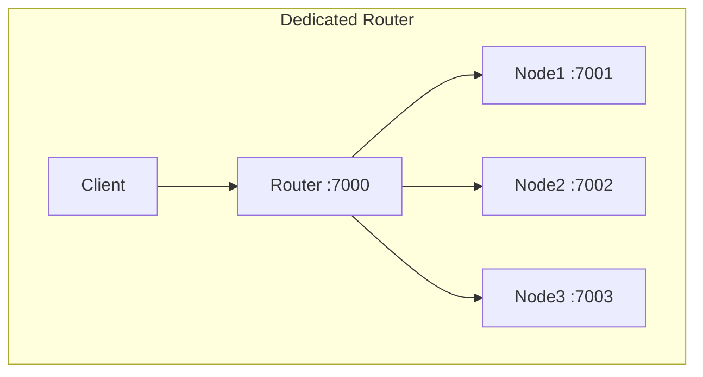

# KV Store

A distributed in-memory key-value store built with **Scala 2.12**, **Play 2.8**, and **JDK 11**.

The same binary runs as either a **storage node** or a **dedicated router**, selected at startup via `kv.role` config.

## Endpoints

| Method | Path | Description                                       |
|--------|------|---------------------------------------------------|
| `GET` | `/kv/:key` | Get key, value, and version for a key             |
| `PUT` | `/kv/:key` | Create or replace a key's value                   |
| `PATCH` | `/kv/:key` | Create or shallow-merge into a key's value        |
| `GET` | `/kv` | (Router only) Stream all keys as NDJSON           |
| `GET` | `/internal/keys` | (Node only) Stream this node's keys as NDJSON; 404 on a router |
| `GET` | `/docs` | Swagger UI (from `conf/routes` comments + `conf/swagger.yml`) |
| `GET` | `/assets/swagger.json` | Generated Swagger 2.0 spec |

**Optimistic locking:** Supply `?ifVersion=<long>` (or `If-Match` header) on PUT/PATCH. Returns `409` on mismatch.

## Multi-node cluster topology

Dedicated router strategy:
- the client talks to one entry point, which is the router node
- the router hashes the key and proxies to the owner node
- internal endpoint to stream keys from each node (fails silently): `GET:/internal/keys`
- public endpoint on router to get aggregation of keys from all nodes: `GET:/kv`



## Class Structure

```
app/
├── Module.scala                    # Guice bindings with role awareness
├── models/
│   ├── VersionedValue.scala        # Case class: value + version
│   └── WriteResult.scala           # Sealed trait: Written | Conflict
├── store/
│   ├── KvStore.scala               # Trait: get/put/patch/keys
│   └── InMemoryKvStore.scala       # Impl: with ConcurrentHashMap
├── controllers/
│   ├── KvHandler.scala             # Trait: controller interface
│   ├── KvDispatcher.scala          # Delegates to KvController or RouterController
│   ├── KvController.scala          # Node role: local store operations
│   ├── RouterController.scala      # Router role: proxy to owner node
│   └── InternalController.scala    # NDJSON streaming for /internal/keys
└── cluster/
    ├── NodeRef.scala               # Case class: id + url
    ├── NodeRegistry.scala          # Reads nodes from config
    ├── Partitioner.scala           # Trait + ModuloPartitioner (MurmurHash3 % N)
    └── RemoteNodeClient.scala      # Thin WS-based HTTP proxy client
```

## Tests

```
test/
├── store/InMemoryKvStoreSpec.scala       # store unit tests
├── controllers/KvControllerSpec.scala    # node HTTP API tests
├── concurrency/CounterSpec.scala         # tests for lost update vs optimistic retry
├── cluster/PartitionerSpec.scala         # tests for determinism, distribution, single-node
└── router/
    ├── RouterTestHarness.scala           # multi-node harness for router integration tests
    └── RouterIntegrationSpec.scala       # end-to-end tests with router
```

Run coverage locally:

```bash
sbt clean coverage test coverageReport
```

Report: `target/scala-2.12/scoverage-report/index.html`

## Running

**Single node (Part 1):**

```bash
sbt run
```

Swagger UI: http://localhost:9000/docs  
Spec JSON: http://localhost:9000/assets/swagger.json  

`sbt swagger` regenerates `target/swagger/swagger.json` without starting the server.

**Multi-node cluster with router (Part 2):**

```bash
sbt stage

# Start 3 nodes
target/universal/stage/bin/kv-store -Dhttp.port=7001 -Dkv.role=node -Dkv.nodeId=node-1
target/universal/stage/bin/kv-store -Dhttp.port=7002 -Dkv.role=node -Dkv.nodeId=node-2
target/universal/stage/bin/kv-store -Dhttp.port=7003 -Dkv.role=node -Dkv.nodeId=node-3

# Start router
target/universal/stage/bin/kv-store -Dhttp.port=7000 -Dkv.role=router -Dkv.nodeId=router
```

configurations in `conf/application.conf` (override with `-D`):

| Key | Default             | Meaning                                   |
|-----|---------------------|-------------------------------------------|
| `play.http.parser.maxMemoryBuffer` | `10m`               | JSON body size limit                      |
| `play.server.akka.requestTimeout` | `10s`               | Server-side request timeout for key stream |
| `kv.remoteTimeout` | `5s`                | Router → node timeout                   |
| `kv.ndjsonMaxFrameLength` | `1024`              | Max bytes per NDJSON line from a node     |
| `kv.nodes` | localhost:7001–7003 | Ordered partition ring                    |

## Stack

- Scala 2.12.18
- Play Framework 2.8.16
- JDK 11
- sbt 1.8.3
- ScalaTest + scalatestplus-play
- Scoverage 2.0.12
- play-swagger 1.6.1 + swagger-ui 5.10.3
