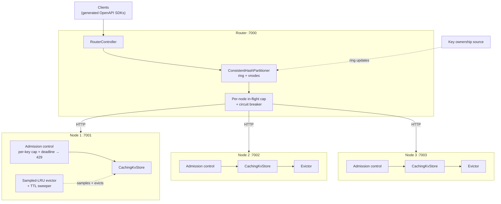
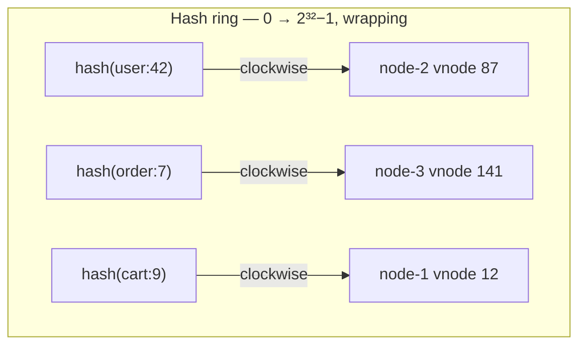

# Roadmap - From KV Store to Distributed Cache

## Context

Part 1 gives us an in-memory kv store, while part 2 adds scaling. For part 3, a very natural progression is to solve issues like hot-key management, unbounded memory, eviction policy etc to turn this into a proper external distributed cache.

As part of this roadmap we will propose solutions to the following challenges while trying to mature the cache project:
- Hot-key protection
- Managing unbounded/bounded memory
- Eviction policy
- Consistent hashing for key ownership

Additionally, we want to introduce the following:
- Observability
- Stable client using openapi specs
---

## Architecture



---

## Components

### 1. Hot-key protection with admission control + circuit breaker

`ConcurrentHashMap.compute` holds the bin lock for the duration of the lambda. That is what gives Part 1
its per-key atomicity, and it is also the hot-key failure mode: every concurrent request for one key
blocks a thread inside `compute`. The lambda is short, but the queue in front of it is unbounded, so a
thousand writers to one key park a thousand threads and starve every *other* key on that node.

```
request → [acquire per-key permit, bounded wait] → compute() → response
                    │
                    └── cap exceeded or wait expired → 429 + Retry-After
```

Key features of the `KeyAdmissionControl` component:
- holds a `Array[Semaphore](K)` indexed by `floorMod(key.hashCode, K)`
- each position thus hold a cap for a stripe of keys
- semaphore has a starting value (i.e. 50) then decreases when operation starts and increases when ends
- initiate retry after a bounded wait-time if semaphore value reaches 0, limit to N retries

Since this admission control increases node latency, Router will also introduce a `CircuitBreaker` to cut off slow nodes from slowing down routed queries

### 2. Managing bounded/unbounded memory

While both bounded and unbounded memory have a memory ceiling, how we handle reaching capacity will be distinct and configurable.

Bounded memory handling:
we calculate an estimate of delta size from current size vs incoming size, and reject if storing the delta pushes the capacity beyond bounded limit
```
newEntryBytes ≈ C + key.length * 2 + Json.stringify(value).length * overheadFactor
delta = newEntryBytes - existingEntryBytes
if (currentTotalBytes + delta > limit) reject
```

Unbounded memory handling:
This part is explained in the next section, we implement it using TTL and sampled LRU.

### 3. Eviction — TTL and sampled LRU

**TTL** can be implemented as an addition `expiredAt` property set by config or request

**LRU** can be implemented by sampling similar to Redis `allkeys-lru`, which approximates the last use tick from a global clock counter, and oldest entry among random K picks is considered least-recently-used.

And finally, a sweeper method which runs periodically identifies and removes expired and least-recently-used entries from storage

### 4. Consistent hashing for key ownership

Currently, we are using modulo hash for determining key ownership:
```scala
// app/cluster/Partitioner.scala
override def ownerOf(key: String): NodeRef = {
  val idx = Math.floorMod(MurmurHash3.stringHash(key), registry.nodes.size)
  registry.nodes(idx)
}
```

This means adding a node to the cluster with N nodes will result in N/(N+1) percent of keys having a different hash output, on a large cluster which can easily mean above 90% of the keys. Thus, with the current hashing a full restart is required of the cluster after any change in topology.

Proposed improvement:
map keys and nodes into the same space, which is a ring of all 32-bit integers, wrapping at 2³²−1. Nodes are
placed by hashing their identity, keys by hashing the key, and a key is owned by the first node clockwise
from its position.



This will also introduce virtual nodes which reduce variance and enable binary search on a node's space in the ring, resulting in faster key lookup.

Overall, the consistent hashing mechanic can reduce key loss to only maximum of 1/N percent in case a node is added to the cluster, thus eliminating the need to of restart and loss of all existing data.

## Trade-offs
- Maturing as cache will result in evictions, which changes the idea that a client can keep aggregating over a value indefinitely using if-version
- Hot key controls will apply limitations in frequent key access, safeguarding resource while inreasing request rejections
- Consistent hashing needs a source of truth, which makes scaling the router horizontally more challenging to maintain

## Effort / Sequence

Listing down the effort in sequence including observability and sdk.

- **Phase-0** : general tech debt
  - Add Prometheus support with Grafana dashboards and alerts
  - Publish generated client library based on openapi specs
- **Phase-1** : improving availability and optimize performance-under-load
  - Router circuit breaker + consistent hashing
  - Node hot key handling
- **Phase-2** : memory management and eviction
  - Bounded memory capacity based rejection
  - Per key stripe cap and sampled-LRU

## Verifying goals achieved

| Goal                  | Measure                                                                       |
|-----------------------|-------------------------------------------------------------------------------|
| Hot key handling      | Single key at high concurrency, while p99 on *other* keys stays within SLO    |
| Memory is bounded     | Sustained write load above the ceiling for hours with stable GC and RAM usage |
| Eviction correctness  | Hit ratio above target under a realistic access pattern                       |
| Consistent key-hashing | Add a node under live traffic causing ~1/(N+1) hit-ratio drop                 |
